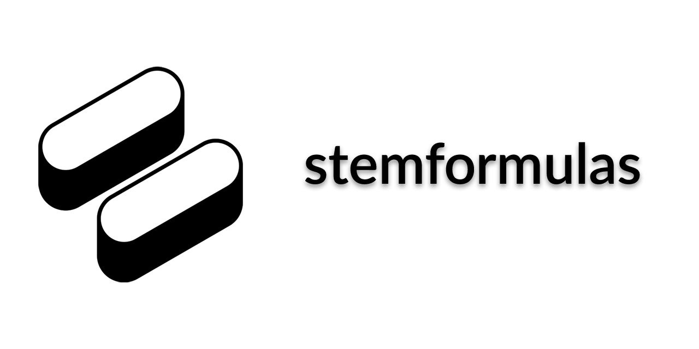

# stemformulas



Welcome to [https://stemformulas.com/](https://stemformulas.com/), the site with the goal of being the best place in the world to look for STEM-related formulas.

## Features:
- 68 formulas and counting (we gotta pump those numbers up)
- The search bar is in focus on site load for quick searching
- The / key can be used to open the search on any page
- LaTeX can be copied by clicking on it on any formula's page
- The site has open-graph tags, so a full preview of the formula is shown when its page is shared on social media
- The site is mobile-friendly

## How to contribute:

There are two ways contribute formulas: suggestions and direct contributions:

1. Suggestions: fill out this Google Form with a formula that you would like to see added to the site:
https://forms.gle/EWjwFmiEQrrjsZEF9

2. Direct contributions: create a pull request following the detailed instructions below.


## Running the site locally:
Setting up this repository locally only requires Git and Docker, and it's honestly very neat. Here's how to do it:
1. Install Git and clone this repository on your command line with the submodules flag:

```
git clone --recurse-submodules https://github.com/stemformulas/stemformulas.github.io.git
```

2. Install the latest version of [Docker Desktop](https://www.docker.com/products/docker-desktop/) and run it. `docker info` should work on your command line when Docker is properly set up and running.

3. Run the site and helper site with Docker in a terminal (in the root directory of this repository):
```
docker compose up -d && docker compose alpha watch
```

The first command runs the site, and the second monitors for file changes to sync them to the Docker container. You should be able to visit the site at `localhost:1313` in your browser, and changes to files in the `content` folder should be reflected on the site (e.g. open the about page and then modify content/about/_index.md).

4. If you ran the docker compose command you should also have a Python applet I wrote up at `localhost:8501` in your browser. This is a GUI that helps you write the tedious parts of a formula's page. You can read more about it in the ChatGPT workflow section at the bottom of this README.


## Adding a formula
With the site running locally, you can now add a formula page to the site and preview how it'll look on the actual site.
Here are the steps for adding a formula (mostly git instructions):

1. In another terminal, create a new branch for your changes:

```
git checkout -b new-formula-name
```

where `new-formula-name` is descriptive of the formula you're adding.

2. Create a folder in `content/formulas/` with the name of your formula. For example, if you're adding the formula for the area of a circle, you would create a folder called `area-of-a-circle`. Inside this folder, create a file called `index.md` and copy the contents of `content/formulas/pythagorean-theorem/index.md` into it (any other index.md would be fine too, but this one shows how to use pictures). This file will contain the information about your formula. Change all the information until it's correct for your formula.

3. Visit your formula's page in your browser (still localhost:1313) and proofread it.

4. (Optional) On the localhost:1313/formulas page, zoom in and take a screenshot of the formula (with reasonable white padding and no black lines) and save it as `preview.png` in your formula's folder. This will be the preview image when the formula is linked on social media. You can look at any existing formulas folder for an example. Optionally, if you have Python installed, run `pip install Pillow` and `python normalize_preview_imgs.py` to size the preview image properly so it never gets cut off in the social media preview image.

5. Push your changes to GitHub (replace `new-formula-name` with your own branch's name from step 1):

```
git status
git add .
git commit -m "write a short message explaining what you added"
git push origin -u new-formula-name
```

6. Create a [pull request](https://github.com/stemformulas/stemformulas.github.io/compare) from your branch to the main branch. We'll review it, give you feedback, and then eventually merge it.

7. In the future, if you want to contribute again, switch to main and pull in changes so that you're up to date:

```
git checkout main
git pull
git checkout -b new-formula-name
```

Then, repeat from step 1.

## ChatGPT workflow
I use ChatGPT and a custom Python GUI to help me write formula pages. Here's how it works:

1. With the Docker setup running, visit `localhost:8501` in your browser.
2. Fill in the formula name, LaTeX, and two sources and click submit. A preview of the LaTeX will be shown, and the app will then make a text dump for you to copy and paste into ChatGPT, basically saying "format this new formula information the same way as this blurb". 
3. Copy the reply from ChatGPT and paste it into the second tab of the Python GUI, which will fix some of the LaTeX formatting. This can usually now be put into an index.md file, with all of the grunt work done. Make sure to fully proofread what ChatGPT gives you, as it is crucial that formulas put on the site are correct.

## Possible future work
- More formulas
- Formula sheet maker
- Better SEO
- Differentiate constants from variables
- More examples for formula usage
