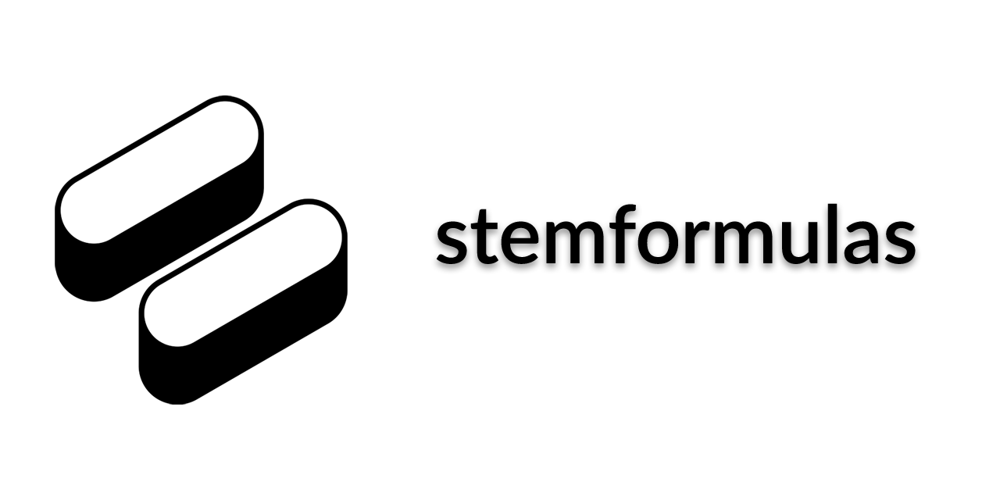

# stemformulas



Welcome to [https://stemformulas.com/](https://stemformulas.com/), the site with the goal of being the best place in the world to look for STEM-related formulas.

## Features:
- 98 formulas and counting (we gotta pump those numbers up)
- The search bar is in focus on site load for quick searching
- The / key can be used to open the search on any page
- LaTeX can be copied by clicking on it on any formula's page
- The site has open-graph tags, so a full preview of the formula is shown when its page is shared on social media
- The site is mobile-friendly

## How to contribute:

There are two ways to contribute formulas:

1. **Suggest on the site**: visit the [submit page](https://stemformulas.com/submit) to suggest a formula.

2. **Direct contributions**: create a pull request following the instructions below.


## Running the site locally:

1. Install Node.js (v18+) and clone this repository:

```
git clone https://github.com/stemformulas/stemformulas.github.io.git
```

2. Install dependencies:

```
npm install
```

3. Run the dev server:

```
npm run dev
```

Visit `http://localhost:8501`. Changes to formula files in `src/content/formulas/` are reflected immediately.

4. To test the submit feature, create a `.env` file with `DISCORD_WEBHOOK_URL=<your webhook link>`.

## Adding a formula

1. Create a new branch:
```
git checkout -b new-formula-name
```

2. Create a file in `src/content/formulas/` named after your formula, e.g. `area-of-a-circle.mdx`. Copy the contents of an existing `.mdx` file (like `pythagorean-theorem.mdx`) as a template and update the frontmatter and body.

3. Visit the formula at `http://localhost:8501/formulas/<your-slug>` and proofread it.

4. (Optional) Take a screenshot of the formula card on the listing page, save as `preview.png` in `content/formulas/<your-slug>/`. Run `python normalize_preview_imgs.py` to size it properly.

5. Push and create a pull request.

## Possible future work
- More formulas
- Formula sheet maker
- Better SEO
- Differentiate constants from variables
- More examples for formula usage
