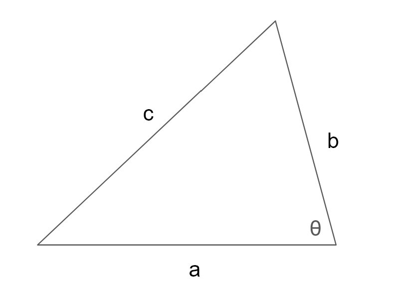



For any triangle:

The following is true:

$$ c^2 = a^2 + b^2 - 2 \cdot a \cdot b \cdot \cos(\theta) $$

Note that the naming of the sides and angle is arbitrary. The formula is true as long as \\(\small \theta\\) is the angle opposite side c.

## Sources
- [Wikipedia](https://en.wikipedia.org/wiki/Law_of_cosines)
- [Byju's](https://byjus.com/maths/law-of-cosines/)
