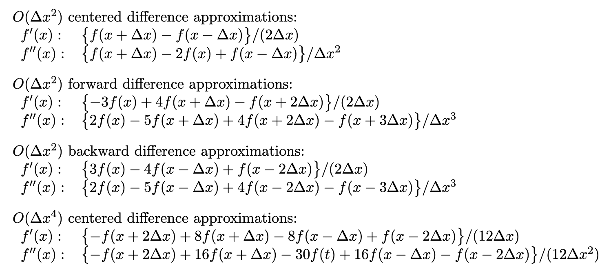



Finite difference approximations are used to approximate derivatives of functions using discretized data, such as data from simulations or sensors. The most common finite difference approximations are for the first and second derivatives, although higher order derivatives can be approximated as well.

## First Derivative
### First-Order Accurate
For a step size of \\(\small h\\), the forward difference, first-order accurate approximation for the first derivative of a function \\(\small f\\) at a point \\(\small x\\) is

$$f'(x) \approx \frac{f(x+h) - f(x)}{h}$$

The accuracy being first-order means that the error is on the order of \\(\small O(h)\\).

### Second-Order Accurate
The centered difference, second-order accurate approximation for the first derivative of a function \\(\small f\\) at a point \\(\small x\\) is

$$f'(x) \approx \frac{f(x+h) - f(x-h)}{2h}$$

The error of this approximation is on the order of \\(\small O(h^2)\\)

## Second Derivative
The most commonly used FDA for the second derivative is the second-order accurate centered difference approximation:

$$f''(x) \approx \frac{f(x+h) - 2f(x) + f(x-h)}{h^2}$$

The error of this approximation is on the order of \\(\small O(h^2)\\)

## Other FDA formulas:
The following are some other useful FDA formulas from [this resource](https://www.dam.brown.edu/people/alcyew/handouts/numdiff.pdf) from Brown.

## Sources
- [Wikipedia](https://en.wikipedia.org/wiki/Finite_difference)
- [Brown](https://www.dam.brown.edu/people/alcyew/handouts/numdiff.pdf)
