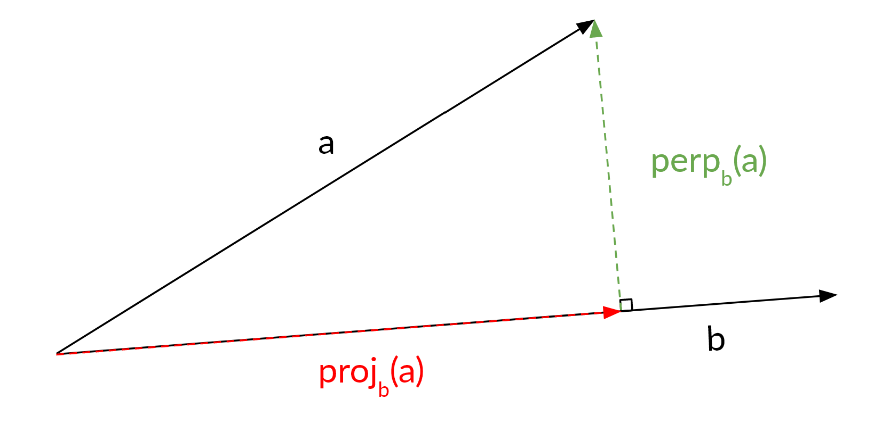


For any vectors \\(\small \vec{a}\\) and \\(\small \vec{b}\\):

The projected (red) and perpendicular (green) vector can be calculated as follows:

$$ proj_{\vec{b}}(\vec{a})=\frac{\vec{a}\cdot\vec{b}}{\|\vec{b}\|^2}\vec{b}=(\vec{a}\cdot\hat{b})\hat{b} $$

$$ perp_{\vec{b}}(\vec{a})=\vec{a}-proj_{\vec{b}}(\vec{a}) $$

Where
* \\(\small \vec{a}\\) is the vector to be projected
* \\(\small \vec{b}\\) is the vector to be projected onto
* \\(\cdot\\) is the [dot product](/formulas/dot-product/)
* \\(\small \|\vec{b}\|^2\\) is the [magnitude](https://en.wikipedia.org/wiki/Magnitude_(mathematics)#Euclidean_vector_space) of \\(\small \vec{b}\\), squared
* \\(\small \hat{b}\\) is the [unit vector](/formulas/unit-vector/) in the direction of \\(\small \vec{b}\\)

## Sources
- [Wikipedia](https://en.wikipedia.org/wiki/Vector_projection)
- [The Organic Chemistry Tutor](https://www.youtube.com/watch?v=Rw70zkvqEiE)
