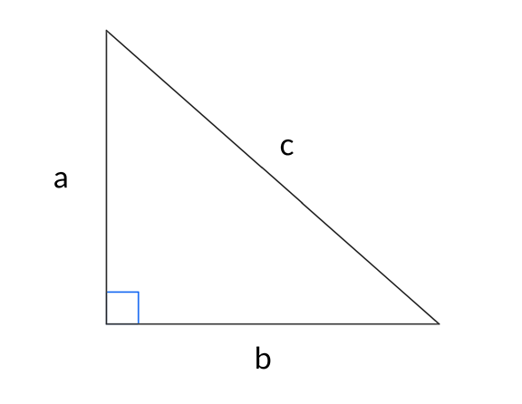

For any right triangle *abc* (see diagram below):

The lengths of the sides are related by the Pythagorean Theorem:


$$a^2 + b^2 = c^2$$

Where

* \\(a\\) and \\(b\\) are the lengths of the legs of the triangle, and
* \\(c\\) is the length of the hypotenuse

## Sources:
* [Wikipedia](https://en.wikipedia.org/wiki/Pythagorean_theorem)
* [Brittanica](https://www.britannica.com/science/Pythagorean-theorem)

## Example

After being rejected by another girl, Kevin bends forward to pick up his hurt ego. His legs contact the floor at a right angle and his arms + torso miraculously reach the ground in front of him.

If his legs are 30 meters long, and his arms + torso
are 50 meters long, how far away is his ego from his legs?

Using the diagram above, a = 30m and c = 50m. Using the pythagorean theorem:

$$ a^2 + b^2 = c^2 \Longrightarrow b = \sqrt{c^2 - a^2} = \sqrt{1600} = 40m$$

