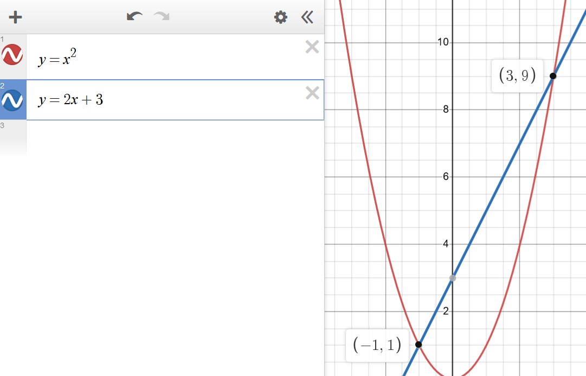


$$x = \frac{-b \pm \sqrt{b^2 - 4ac}}{2a}$$

Where
* \\(x\\) is the solution to the quadratic equation \\(ax^2 + bx + c = 0\\),
* \\(a\\) is the coefficient of the \\(x^2\\) term,
* \\(b\\) is the coefficient of the \\(x\\) term, and
* \\(c\\) is the constant term

## Sources
- [Wikipedia](https://en.wikipedia.org/wiki/Quadratic_equation)
- [Khan Academy](https://www.khanacademy.org/math/algebra/x2f8bb11595b61c86:quadratic-functions-equations/x2f8bb11595b61c86:quadratic-formula-a1/v/using-the-quadratic-formula)

## Example
Find the intersection points of the parabola \\(y = x^2\\) and the line \\(y = 2x + 3\\).

We know that these two will intersect when \\(x^2 = 2x + 3\\). We can solve this quadratic equation using the quadratic formula.

First, we rearrange to get it into the correct form: \\(x^2 - 2x - 3 = 0\\). Then, we plug in the coefficients into the quadratic formula,
with a = 1, b = -2, and c = -3.

$$x = \frac{-b \pm \sqrt{b^2 - 4ac}}{2a} \Longrightarrow x = \frac{-(-2) \pm \sqrt{(-2)^2 - 4(1)(-3)}}{2(1)} $$

$$\Longrightarrow x = \frac{2 \pm \sqrt{4 + 12}}{2} \Longrightarrow x = \frac{2 \pm 4}{2} \Longrightarrow x = 3, -1$$

Plugging these x values into either of the original equations gives us the y values of the intersection points.

The final answer is \\((3, 9)\\) and \\((-1, 1)\\), which we can verify on a graph:

