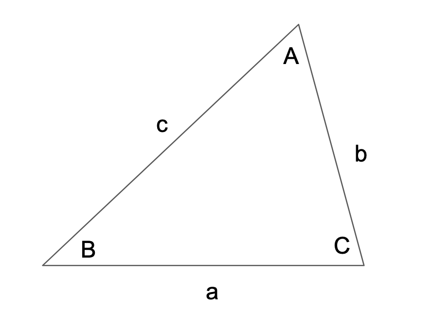



For any triangle with angles A, B, C and side lengths a, b, c:

The ratio of the length of a side to the sine of the angle opposite that side is the same for all three sides:

$$\frac{\sin(\small \text{A})}{\text{a}} = \frac{\sin(\small \text{B})}{\text{b}} = \frac{\sin(\small \text{C})}{\text{c}}$$

## Sources
- [Wikipedia](https://en.wikipedia.org/wiki/Law_of_sines)
